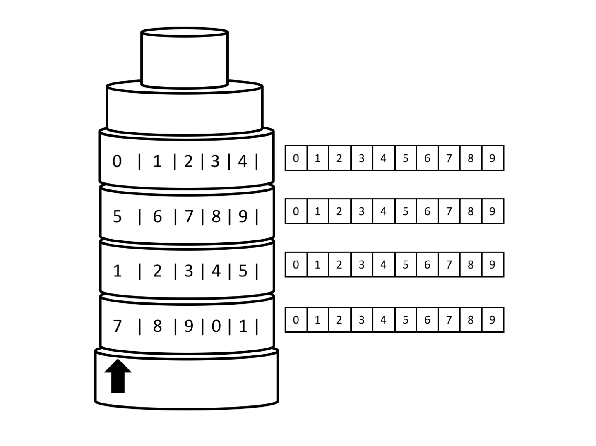
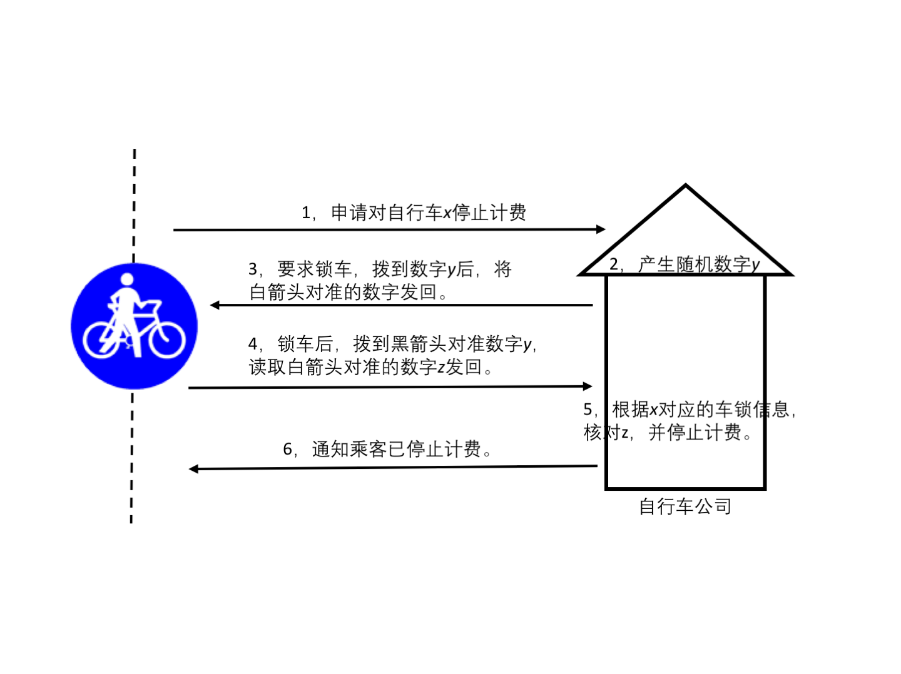

# 锁车趣题

刘新宇
Email: liuxinyu95@gmail.com

## 共享自行车

在我撰写这一章节的时候，共享自行车正在流行。一些公司在城市的大街小巷投放一些自行车。如果一个人要使用，他需要支付一定的押金，然后就可以打开车锁骑走，共享自行车公司按照使用时间收费。到达目的地后，从押金中扣除使用费就可以了。

为了实现在任何时间、地点，都能够租、还车，自行车公司通过使用当时已经普及的智能手机，来实现自行车的租用、计时、收费。一个典型的场景大致如下：

1. 一个行人p在路边看到一辆上锁的共享自行车，这辆自行车上有一个唯一的编号x，他通过自己的手机联系自行车公司，告知他要使用这辆自行车；
2. 自行车公司收到这一行人p的请求，向他收取使用自行车x的押金；
3. 行人通过自己的智能手机向自行车公司支付押金；
4. 自行车公司收到押金后，通过某种方式打开自行车x的车锁；
5. 行人将自行车骑到某地点后，将自行车停好，并通过手机告知自行车公司他要还车；
6. 自行车公司收到请求后，根据自行车x的使用时间，从押金中扣除费用，将押金退还行人p，同时通过某种方式将自行车x锁好。

这一使用方式中有一个环节非常关键：就是锁车。如果在退还押金后，没有将车锁上，此后的所有行人就可以“免费”使用这辆车了。为此，一些自行车公司制造了复杂的智能电子车锁。车锁能够和自行车公司通讯。这样自行车公司就能“遥控”打开和锁上自行车。还有的自行车公司，使用便宜的数字转盘密码锁，见图1。由于没有能够解决锁车问题，不得不派出工作人员，到大街小巷检查，看到没锁的自行车就锁上。甚至出现了有人在互联网上共享单车编号和密码对应表的情况。这样不想出钱的人，就可以通过自行车编号，查到密码，从而“免费”骑车。

图1，常见的数字转盘密码锁。每个转盘上按照顺序为0, 1, ..., 9共10个数字。图中4个转盘使得密码为0000到9999中的一个，共支持10000个密码。转动转盘，是的黑色箭头一行的数字为密码即可开锁。开锁后转盘被卡住不能转动。

有没有一种巧妙的方式，既不用使用电子设备，又能够解决锁车问题呢？

## 巧解锁车趣题

解决锁车趣题的关键在于，我们需要通过某种方式，确认自行车已经上锁后，才停止计费。怎样才能进行这种确认呢？以图1中的密码锁为例，开锁时，乘客将自行车的编号x通过手机发给自行车公司，自行车公司开始计费后，将x对应的4位密码发到行人的手机上，例如7150，行人转动密码盘，使得黑色箭头对准7150，就可以开锁了。当乘客停好车，通过手机联系自行车公司要求停止计费时，自行车公司可以发给乘客一个随机4位数字y，例如3194，要求乘客将密码盘拨到这个数字才停止计费。由于密码盘只有在上锁后才能转动。因此这个问题就转换为了：如何保证乘客将密码盘转动到某一指定数字上才停止计费的问题。

但这个新问题丝毫不比老问题简单。如果能够让密码锁有某种“计算”功能，当乘客收到自行车公司发来的y，他必须锁车后，转动密码盘得到另一数字z=f(y)。然后行人将z发回给自行车公司验证，验证成功后才停止计费。这样就能解决锁车难题了。

接下来就要想出如何实现上述的“计算”功能。其中一种方法就是让每个密码盘上的数字顺序不是简单的从0、1增加到9，而是某种随机的顺序。如图2(b)所示。

(a)普通锁的密码盘都是从0到9的顺序。

(b)密码盘上的10个数字顺序是随机的。

四个密码盘上的数字的顺序都是随机印上去的，同时增加一个白色箭头。

每个密码盘上的10个数字顺序是随机的，自行车公司事先知道每辆自行车上的密码盘数字顺序。当行人到达目的地停车时，他通过手机告诉自行车公司申请停止计费。自行车公司生成一个4位随机数，例如3194发到行人的手机上，并要求行人拨动车锁密码盘，使得黑色箭头对准3194，然后将白色箭头对准的数字发回。由于行人必须锁车后才能拨动密码盘，所以他只能先锁好车。拨到3194，然后将白色箭头对准的数字，按照图中的例子，也就是4466发回给自行车公司。由于自行车公司事先知道编号为x的自行车锁的密码盘顺序，所以可以核对4466是否正确。如果正确就通知行人停止计费。这一过程如图3所示。

验证锁车、并停止计费的过程。

这一过程对于大多数正常使用自行车的人都有效。由于密码盘的随机性，行人收到自行车公司要求拨到的数字后，不锁车而直接猜测出白色箭头对应的数字的难度较大。但是这一解法仍然存在一个严重的漏洞。

## 亡羊补牢
由于行人一旦开锁用车，他就知道自行车的密码了。尽管在最后还车的环节，我们迫使他锁车并旋转密码锁到指定的位置以结束计费，但是行人一旦确认计费已经停止，他可以再次用记住的密码打开车锁，然后离开。

为了解决这一漏洞，自行车公司可以设置“锁车举报奖励”。即任何行人，如果发现某辆车没有锁，他可以申请获得举报奖励。申请方法如下：

1. 行人使用手机，通知自行车公司，他发现自行车x没有锁。申请获得奖励；
2. 自行车公司收到请求后，要求行人发来自行车锁上黑色箭头对准的数字（即开锁密码）进行验证；
3. 验证后，自行车公司产生一随机数字y，要求行人锁车，并将密码锁拨到数字y，然后将白色箭头所对准的数字发回；
4. 行人锁车后，转动密码锁，使得黑色箭头对准y，然后读出白色箭头对准的数字z，发回给自行车公司；
5. 自行车公司收到z后，根据自行车x的密码盘信息，验证z。如正确，就把奖励金发给行人；

简单来说，锁车举报验证的过程和上述锁车过程的解法类似。自行车公司迫使行人锁车后才发放奖励。为了避免在得知他人的用车密码后，反复骗取锁车奖励金的行为，自行车公司还需要监控是否某一辆自行车被多次领取奖励金。

## 练习
为了惩罚锁车后又故意打开自行车的行为，自行车公司决定从最后一次使用该自行车的顾客的押金内扣除费用，以奖励举报。请问这样做合理么？会出现什么潜在的问题？
